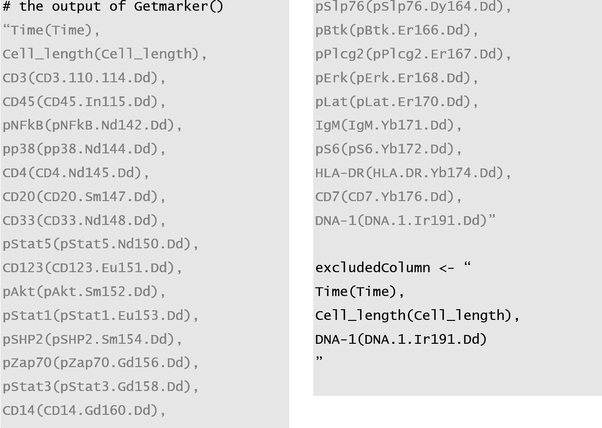
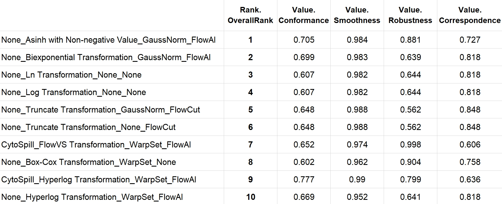
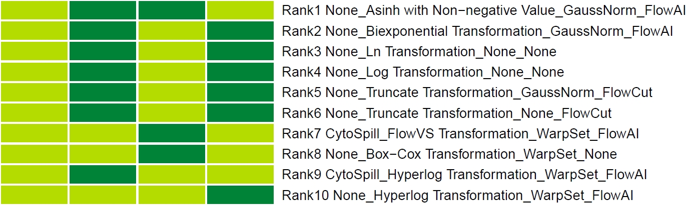

<style>
pre code {
    line-height: 2; /* 设置代码块的行间距 */
}
</style>

```{r, include = FALSE}
knitr::opts_chunk$set(
  collapse = TRUE,
  comment = "#>"
)
```


# Introduction

`ANPELA` includes various built-in processing methods for Cytometry Single-cell Proteomics data (CySCP) data. In total, `ANPELA` provides **6** compensation methods, **15** transformation methods, **6** normalization methods, and **4** signal clean methods, which were listed below.

- **Compensation:** the process step of removing unwanted spillover resulting from signal crosstalk and spectral overlap across detection channels. `ANPELA` provides 6 compensation methods, including `AutoSpill`, `CATALYST`, `CytoSpill`, `FlowCore`, `MetaCyto` and `spillR`. No compensation (`None`) is also allowed in `ANPELA`.
- **Transformation:** the process step of adjusting the data with a heavily skewed distribution to a normal distribution. `ANPELA` provides 15 transformation methods, including `Arcsinh Transformation`, `Asinh with Non-negative Value`, `Asinh with Randomized Negative Value`, `Biexponential Transformation`, `Box-Cox Transformation`, `Centered Log Ratio Transformation`, `FlowVS Transformation`, `Hyperlog Transformation`, `Linear Transformation`, `Ln Transformation`, `Log Transformation`, `Logicle Transformation`, `Quadratic Transformation`, `Split Scale Transformation` and `Truncate Transformation`. No transformation (`None`) is also allowed in `ANPELA`.
- **Normalization:** the process step of eliminating signal decay and technical variability across all files and batches over long-term data acquisition. `ANPELA` provides 6 normalization methods, including `Bead-based Normalization`, `GaussNorm`, `Mean Normalization`, `Min-max Normalization`, `WarpSet` and `ZScore`. No normalization (`None`) is also allowed in `ANPELA`.
- **Signal Clean:**  the process step of identifying and removing abrupt signal shifts and changes that derive from (i) abrupt changes in the flow rate, (ii) clogs within the capillary tubes, (iii) temporary disruptions in cytometer fluidics, and (iv) unstable data acquisition. `ANPELA` provides 4 signal clean methods, including `FlowAI`, `FlowClean`, `FlowCut` and `PeacoQC`. No signal clean (`None`) is also allowed in `ANPELA`.

Details of each method provided in the vignette ‘Methods_Introduction’ built in the package.

```{r vignette_methods, eval = FALSE}
vignette('Methods_Introduction')
```

`ANPELA` can execute over 3,000 workflows. To identify the best workflow, we developed two sets of criteria specifically for ***Cell Subpopulation Identification (CSI)*** and ***Pseudo-time Trajectory Inference (PTI)***, which represent the most prevalent and pivotal analyses in proteomics.

- **CSI** focuses on identifying and classifying different subpopulations within a cell population. By analyzing cellular phenotypes, gene expression, or protein levels, researchers can uncover cellular heterogeneity. This is crucial for understanding biological processes, disease mechanisms, and treatment responses, especially in cancer research and immunology.

- **PTI** focuses on inferring the temporal order of cells during developmental or response processes. By analyzing single-cell transcriptomic data, PTI can reconstruct how cells change over time in specific biological processes. This helps in studying cell fate determination, differentiation processes, and the mechanisms of dynamic biological events.

Now, the following will introduce the specific steps for using `ANPELA`.

# Preparation

## Environment Preparation

Now, the following will introduce the specific steps for user.

First, you need to create a folder entitled ‘ANPELA’ under the directory of your preference and set R working directory to this folder. Then, load `ANPELA` *R* package.

```{r environment, eval=FALSE, message=FALSE, warning=FALSE}
setwd('Your/Working/Directory/ANPELA/')
library(ANPELA)
```

## Data Preparation

You can use the example data provided in `ANPELA` to try it out.

**Example data acquired from** ***flow cytometry*** **for CSI analysis** ([Download_287 MB](https://idrblab.cn/anpela2024/example_data/FC_CSI.zip)): A single-cell proteomic dataset involving 23 markers of fresh thymus tissue obtained from nine patients undergoing elective thymectomy, including three myasthenia gravis (MG) patients and six healthy controls (non-MG). 

**Example data acquired from** ***mass cytometry*** **for CSI analysis** ([Download_174 MB](https://idrblab.cn/anpela2024/example_data/MC_CSI.zip)): A single-cell proteomic dataset consisting 35 surface markers of two antigen specific T cell lines generated by naïve CD4+ T cells stimulated with tolerogenic dendritic cells (tolDCs) or mature inflammatory myeloid dendritic cells (mDCs) pulsed with proinsulin peptide. 

**Example data acquired from** ***flow cytometry*** **for PTI analysis** ([Download_3.70 MB](https://idrblab.cn/anpela2024/example_data/FC_PTI.zip)): A single-cell proteomic temporal dataset using 10 cell surface markers in vitro hematopoietic differentiation system from human embryonic stem cells (HUES9) at 6 sequential timepoints (0, 2, 4, 6, 8, 10 day) to capture cells at different developmental stages. 

**Example data acquired from** ***mass cytometry*** **for PTI analysis** ([Download_882 KB](https://idrblab.cn/anpela2024/example_data/MC_PTI.zip)): A gated single-cell proteomic temporal dataset encoding the activation dynamics of 14 CD8+ cell intracellular markers perturbed by tetradecanoylphorbol acetate (PMA)/ionomycin at 8 sequential timepoints (0, 1, 5, 15, 30, 60, 120 and 240 min). 

`ANPELA` requires specified data formats (you can refer to the example data), which include (**1**) the FCS raw data files (mandatory); (**2**) the CSV metadata file for sample annotation (mandatory); (**3**) the CSV pathway hierarchy file for PTI studies (optional); and (**4**) the prior knowledge data file (optional). The metadata file should contain two columns: for CSI-related SCP research, the columns should be labeled as "filename" and "condition"; for PTI-related SCP research, the columns should be labeled as "filename" and "timepoint".

-	"filename" represents the file name of the raw data, which should correspond exactly to the file name of the raw data files but without the ".fcs" extension;
-	"condition" refers to the binary experimental conditions in CSI-related SCP experiments, such as control or experimental, each condition should have at least two FCS files;
-	"timepoint" indicates the sampling time in PTI-related SCP experiments, requiring at least two time points, for example, 1 day, 3 days, 5 days, 7 days.

Reading the FCS files, the metadata file and the pathway hierarchy file are a crucial step before data processing. Let’s take Example data acquired from mass cytometry for PTI analysis from research about signal transduction as an example. Download the Example data acquired from mass cytometry for PTI analysis and position the files to the working directory.

```{r read, eval=FALSE}
datapath <- 'Your/Working/Directory/ANPELA/'
pathwayhierarchy <- 'Your/Working/Directory/ANPELA/Pathway_Hierarchy.csv'
```

In this way, `ANPELA` will access your data. Next, you need to use the function `Getmarker` to prepare the marker indexes for data processing and performance assessment, with subsequent manual removal of non-protein columns as needed. Also using Example data acquired from mass cytometry for PTI analysis as an example, running the function `Getmarker` will return a character string separated by commas and line breaks which may include non-protein columns such as 'Time(Time)' and 'Cell_length(Cell_length)'. Then you should remove these non-protein columns and assign those columns to `excludedColumn`.

```{r Getmarker, eval=FALSE}
Getmarker(datapath)
```

```{r Getmarker_png, echo = FALSE, out.width = "70%", out.extra='style="margin-left: 30px;"'}

```

# Data Processing and Performance Assessment

The four one-step functions in `ANPELA`, `FC_CSI`, `MC_CSI`, `FC_PTI`, `MC_PTI`, can accomplish data processing and performance assessment in just one step, which should be used in specific condition. `FC` and `MC` denote that the raw data files are acquired from *flow cytometry (FC)* and *mass cytometry (MC)*, respectively. `CSI` and `PTI` refer to *Cell Subpopulation Identification (CSI)* and *Pseudo-time Trajectory Inference (PTI)*, respectively.

Example data acquired from mass cytometry analysis for PTI is a data set acquired from mass cytometry (MC), and is designed for a Pseudo-time Trajectory Inference (PTI) task. So you should use the function `MC_PTI` to process the data and assess the performance. 

The parameter `name` defines the filename of your assessment results. The parameter `cores` decides the number of CPU cores to be employed for performing parallel computing. To avoid memory explosion due to parallel computing, the default is the largest integers not greater than half of the number of CPU cores on the current host. You can also adjust the parameter `cores` according to your specific needs, especially when handling extensive data files.

```{r MC_PTI, eval=FALSE}
name <- 'MC_PTI_case'
MC_PTI(name = name, datapath = datapath, 
       excludedColumn = excludedColumn,
       pathwayhierarchy = pathwayhierarchy, 
       cores = floor(parallel::detectCores()/2))
```

**Note**: `ANPELA` will run as many data processing workflows as possible, but certain methods require additional input. Due to the potentially large volume of data and workflows, which can consume significant time and memory, certain parameters are available to adjust the process. Besides the four core functions in `ANPELA`, more functions are available to realize the data processing and performance assessment in a costumed way. You can choose the function(s) and adjust the parameter values according to your specific needs, referring to the vignettes of functions in `ANPELA` *R* package. 

# Output

Through the above steps, you obtained the data processing and performance assessment output files for Example data acquired from mass cytometry for PTI analysis, which are located in the **process_res** and **assess_res** folders, respectively. 

## Results of Data Processing

The **process_res** folder stores the results of data processing. The format of data processing output files is determined by the parameter `save_processed_res`: (**1**) 'one_folder' denotes that successfully processed results will be saved as separate RData files in the 'process_res' folder; (**2**)'one_RData' denotes that all processed results will be saved as one RData file in the 'process_res' folder [*default ="one_folder"*].

```{r process_res.png, echo = FALSE, out.width = "70%", out.extra='style="margin-left: 30px;"'}

```

<div style="text-align: left; margin-left: 50px;">the folder process_res when `save_processed_res` = 'one_folder'(excerpt)</div>

## Results of Performance Assessment

The **assess_res** folder stores the results of performance assessment, which includes 3 files: 

```{r assess_res_file.png, echo = FALSE, out.width = "50%", out.extra='style="margin-left: 30px;"'}

```

<div style="text-align: left; margin-left: 50px;">3 files generated in the 'assess_res' folder</div>

(**1**) **MC_PTI_case_Ranking_Table.csv** contains the overall ranking results of all data processing workflows, where the 'Rank' column represents the overall ranking, and the 'Value' column shows the scores for different assessment criteria. 


```{r assess_res_table.png, echo = FALSE, out.width = "95%", out.extra='style="margin-left: 30px;"'}

```

<div style="text-align: left; margin-left: 50px;">MC_PTI_case_Ranking_Table.pdf(excerpt)</div>

(**2**) **MC_PTI_case_Ranking_Figure.pdf** visualizes the overall ranking results to help users better understand the differences among various data processing workflows. Different colors represent different performance assessment levels: dark green indicates '*Superior*', light green indicates '*Good*', and red indicates '*Poor*'. 

```{r assess_res_figure.png, echo = FALSE, out.width = "90%", out.extra='style="margin-left: 30px;"'}

```

<div style="text-align: left; margin-left: 50px;">MC_PTI_case_Ranking_Figure.pdf(excerpt)</div>

(**3**) **MC_PTI_case_assess.RData** contains 2 tables, 'table' and 'table2', which provide the raw scores for different assessment criteria and performance assessment levels categorized by thresholds, respectively.

## Records

In addition, **log.txt** and **info_saved.RData** files are also generated simultaneously. **log.txt** records the processing details while **info_saved.RData** records the information related to 'metadata' and 'index_protein'.


